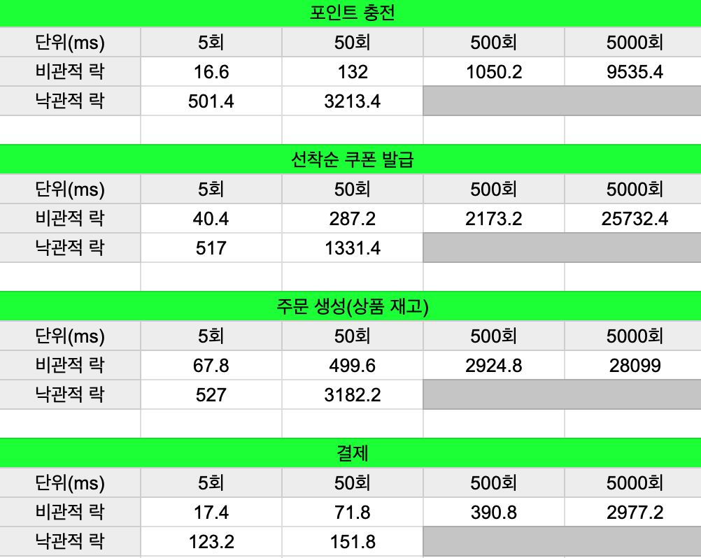
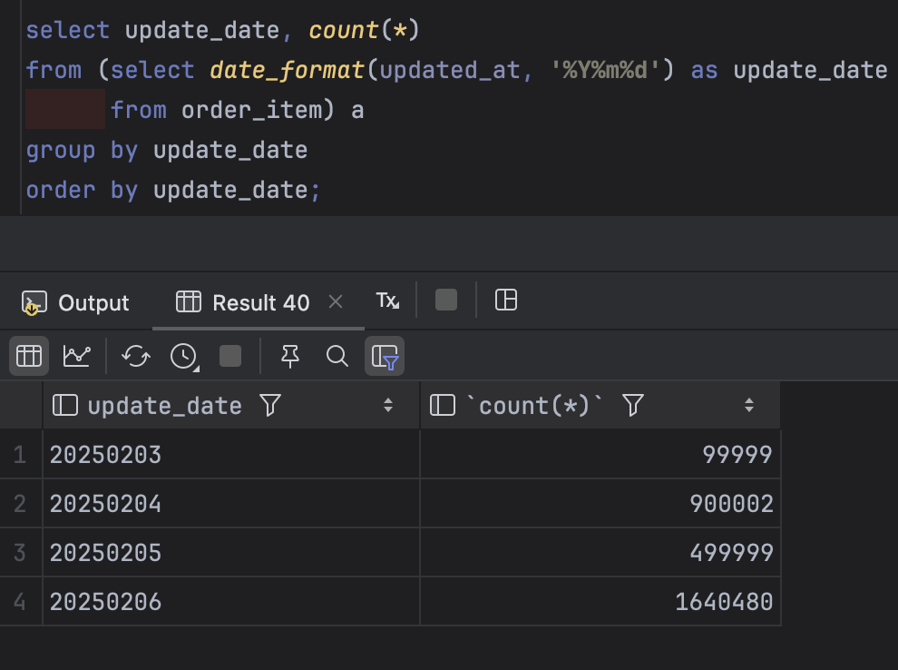
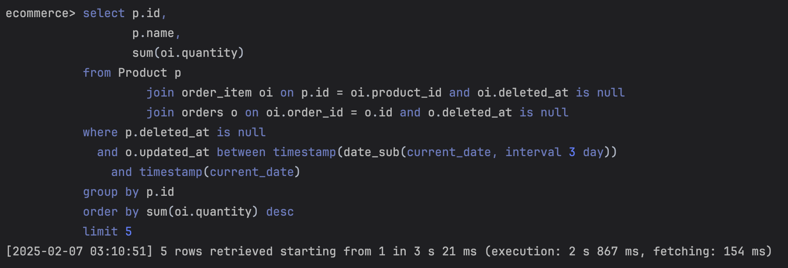
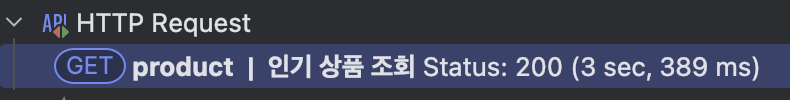
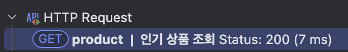
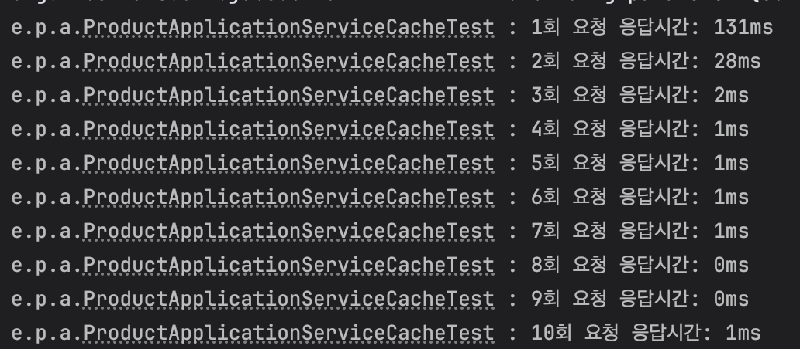

# 이커머스

- 간단한 이커머스 서비스
- 사용 기술: JDK 17, Spring Boot 3.4.1, MySQL, JPA

## 시나리오 분석

<details>
<summary>접기/펼치기</summary>

- 장바구니 API는 API 스펙에서 제외되었지만, '사용자 식별자와 (상품 ID, 수량) **목록**을 입력받아'라는 주문/결제 API 요구사항에 따라 추가한다.

#### 잔액 충전/조회 API

- 잔액 충전/조회는 회원만 가능하다.
- 최소 충전 포인트는 1이상이다.
- 최대 충전 포인트이상으로 포인트를 충전할 수 없다. 단, 상품 환불로 돌려 받은 포인트는 최대 충전 포인트 이상으로 보유할 수 있다.

#### 상품 조회 API

- 상품 목록, 상세 조회는 비회원/회원 모두 가능하다.
- 상품의 가격, 수량은 변동이 심하다고 가정한다.
- 상품의 그룹, 카테고리는 없다고 가정한다.
- 비회원/회원 모두 상품 상세 조회에서 수량 선택 후 장바구니에 추가할 수 있다.
- 상품 상세 조회에서 수량 선택 후 바로 구매가 가능하다. 단, 구매는 회원만 가능하다.

#### 선착순 쿠폰 API

- 쿠폰 목록, 상세 조회는 비회원/회원 모두 가능하다.
- 쿠폰 발급은 회원만 가능하다.
- 쿠폰마다 최대 발급 가능 갯수가 정해져있다.
- 쿠폰은 상품에 적용할 수 있는 타입과 주문 전체에 적용할 수 있는 타입이 있다.
- 쿠폰의 할인 방식은 정액(정해진 금액 할인)할인과 정률(정해진 비율 할인)할인이 있다.
- 쿠폰마다 최대 할인 금액이 존재한다.
- 실제 할인 금액은 할인을 적용한 금액과 최대 할인 금액 중 낮은 금액을 할인한다.
- 쿠폰의 유효 기간은 유효 날짜가 지정되는 방식(e.g. 2025년 1월 10일까지)과 발급 후 몇일 이내까지 유효한 방식(e.g. 발급 후 10일동안 유효)이 있다.
- 동일한 회원에 대해 중복 쿠폰 발급은 되지 않는다. 쿠폰은 1인 1매를 원칙으로 한다.

#### 주문/결제 API

- 주문은 상품 상세 페이지에서 수량 선택 후 바로 주문하는 방법과 장바구니에서 여러 상품을 주문하는 방법이 있다.
- 주문 시점의 판매 상태, 가격, 재고로 주문이 이루어진다.
    - 주문 시점에 판매 상태가 판매 중이 아닌 경우 주문할 수 없다.
    - 주문 시점의 가격으로 주문 금액이 계산된다.
    - 주문 시점의 재고가 사용자가 요청한 수량보다 적으면 주문할 수 없다.
- 쿠폰으로 할인된 금액을 실제로 결제한다.
- 이미 충전된 포인트로 결제하며, 부족한 경우 결제할 수 없다. 포인트 충전 후 다시 결제를 시도할 수 있으며 그 동안 변경된 가격/재고의 영향을 받지 않는다.
- 결제 성공시 주문 정보를 데이터 플랫폼에 전송하며, 전송 실패시 처리는 추후 정한다.

#### 상위 상품 조회 API

- 최근 3일간 가장 많이 팔린 상위 5개의 상품 정보를 제공한다.
- 최근 3일이란 정각(00시 00분)을 기준으로 한다.
    - e.g. 2025년 1월 4일에 집계하는 상위 상품은 2025년 1월 1일 00시 00분부터 2025년 1월 4분 00시 00분까지의 판매 결과를 집계한다.
- 매일 00시 00분에 스케줄러를 통해 상위 상품을 집계한다.
- 스케줄러에서 집계 실패시 재시도하지 않고, 모니터링 툴을 통해 개발자에게 알린다.

#### 장바구니 API

- 상품 상세 페이지에서 판매 중이며, 재고가 충분하다면 장바구니에 등록할 수 있다.
- 장바구니 API는 비회원/회원 모두 이용할 수 있다.
- 장바구니에서 제품의 수량 변경시 보유 재고이하로 설정해야한다.
- 장바구니에 등록한 제품의 판매 상태, 가격, 재고는 언제든지 변경될 수 있다.
- 장바구니에 등록한 상품들 중 유효한 판매 상태, 재고를 가진 상품들만 주문할 수 있다.

</details>

## Mock API 서버 구동

1. docker-compose.yml 실행
2. `http://localhost:8082` 접속

## 스웨거 스크린샷

<details>
<summary>접기/펼치기</summary>


</details>

## 프로젝트 구조

<details>
<summary>접기/펼치기</summary>

```markdown
main
├── java
│ └── io
│ └── hhplus
│ └── ecommerce
│ ├── EcommerceApplication.java
│ ├── cart
│ │ ├── application
│ │ │ ├── request
│ │ │ └── response
│ │ ├── domain
│ │ ├── infra
│ │ │ ├── request
│ │ │ └── response
│ │ └── presentation
│ │ ├── request
│ │ └── response
│ ├── coupon
│ │ ├── application
│ │ │ ├── request
│ │ │ └── response
│ │ ├── domain
│ │ ├── infra
│ │ │ ├── request
│ │ │ └── response
│ │ └── presentation
│ │ ├── request
│ │ └── resonse
│ ├── global
│ │ ├── CommonApiResponse.java
│ │ ├── config
│ │ └── exception
│ │ └── openapi
│ ├── order
│ │ ├── application
│ │ │ ├── request
│ │ │ └── response
│ │ ├── domain
│ │ ├── infra
│ │ │ ├── request
│ │ │ └── response
│ │ └── presentation
│ │ ├── request
│ │ └── response
│ ├── payment
│ │ ├── application
│ │ │ ├── request
│ │ │ └── response
│ │ ├── domain
│ │ ├── infra
│ │ │ ├── request
│ │ │ └── response
│ │ └── presentation
│ │ ├── request
│ │ └── response
│ ├── point
│ │ ├── application
│ │ │ ├── request
│ │ │ └── response
│ │ ├── domain
│ │ ├── infra
│ │ │ ├── request
│ │ │ └── response
│ │ └── presentation
│ │ ├── request
│ │ └── response
│ └── product
│ ├── application
│ │ ├── request
│ │ └── response
│ ├── domain
│ ├── infra
│ │ ├── request
│ │ └── response
│ └── presentation
│ ├── request
│ └── response
└── resources
└── application.yml

```

</details>

## 회고

<details>
<summary>접기/펼치기</summary>

챕터 2를 마무리하며

2024년 12월 28일부터 오늘(2025년 1월 17일)까지 3주 동안 이커머스 도메인을 설계부터
간단한 구현까지 진행하면서 각 주차 별로 겪은 일을 돌아보고 마지막에 느낀 점을 작성하려고 한다.

첫 주차는 설계 주차였다. 이커머스라는 생소한 도메인이었지만 그동안 기획자 없이 고객과
직접 소통하면서 시스템을 만들어왔었기 때문에 크게 걱정하지 않았다. 하지만 돌이켜보면
첫 주차가 가장 힘들었던 시간이었다. 중간에 공휴일이 껴있었음에도 과제 마지막 날에 밤샘을 피할 수 없었다.
시퀀스 다이어그램과 플로우 차트를 처음 작성해 보는 것은 크게 문제가 되지 않았다. 설계 그 자체가 문제였다.
'카테고리별로 검색 조건을 다르게 하려면 어떻게 해야 할까?', '상품의 상세 옵션은 어떻게 구현하는 거지?' 등의
고민을 하다 보니 3일 차부터는 꿈에서도 설계하기 시작했다.

둘째 주차에는 1주 차에 했던 설계를 바탕으로 기능 구현을 진행했다. API 하나를 구현할 때마다 바로바로 테스트 코드를 작성했고,
가능하다면 통합 테스트까지 작성했다. 하지만 점점 여러 도메인간의 협력이 필요한 주문, 결제와 같은 비즈니스 문제를 풀어나가면서
처음에 작성했던 API 명세들이 점점 변경되기 시작했고, 테스트 코드도 깨지기 시작했다.
뭐, 덕분에 테스트 코드를 더 많이 짜볼 수 있어서 좋았지만, 실제 회사에서 일어난 일이었다고 생각하면 아찔했다.

셋째 주차는 2주 차에 구현한 기능들을 보완했다. 설계하면서 '정액/정률 쿠폰' 기능 구현을 가장 기대했었는데
시간 관계상 해당 기능을 구현하지 못했다. 그래서 금요일부터 바로 기능 구현에 들어갔다. 역시나 기대했던 만큼 생각할 거리가 많았던 기능이었다.
다만 3주 차 과제와 직접적인 관련은 없기 때문에 과제 PR에 포함하지 못하는 게 아쉬웠다.
그리고 CORS 필터를 구현했다. 기능을 구현하자마자 테스트를 할 수 있을까라는 생각부터 들어서 조금은 성장한 것 같은 기분이 들었다.

5주 차 멘토링 때에도 잠깐 얘기했었는데 그동안 공부를 한다고 하면 책이나 인강을 보고 따라 치는 정도가 전부였다.
뭔가를 만들어보고 싶어도 내가 짜는 코드가 좋은 코드인지 확신이 서지 않은 상태에서 무작정 만들기만 하는 것은  
지도 없이 망망대해를 건너는 것과 같다고 생각했다.
하지만 이번 과제를 진행하면서 어떤 고민을 해야 좀 더 좋은 코드가 될 수 있을지 조금은 깨달은 것 같다.

</details>

## 동시성 문제 해결방법 분석

<details>
<summary>접기/펼치기</summary>

- 이커머스 시나리오에서 발생할 수 있는 동시성 문제를 해결하기 위해 낙관적 락, 비관적 락을 적용해본다.
- 락 메커니즘별 성능을 비교해보고, 코드를 작성하면서 느낀 복잡도를 작성한다.
- 쓰레드 풀은 기본 20으로 설정한다. (테스트 진행 컴퓨터의 쓰레드 수 = 10)
- 동시 요청 횟수는 5, 50, 500, 5000으로 설정하여 테스트를 진행하며, 각각 5회씩 측정한다.
- 단, 낙관적 락의 경우 요청 횟수를 50까지만 테스트하며, 쓰레드 풀 크기, 재시도 횟수, 재시도 간격 등을 조절하면서 경향성을 확인한다.
    - 쓰레드 풀 크기가 20인 경우 너무 많은 실패를 하기 때문에 10, 20 모두 테스트한다.
    - 재시도 횟수는 5, 10, 15로 테스트하고, 재시도 간격은 100ms 단위로 테스트한다.
    - 최대 재시도 간격은 1000ms로 설정하며, 동시성 문제를 해결하지 못한 경우 성능을 기록하지 않는다.
- 성능 측정은 `System.currentTimeMillis()`를 이용하여 측정한다.

</details>

### 동시성 테스트 세팅 가이드

<details>
<summary>접기/펼치기</summary>

- `쓰레드 풀 크기 < CountDownLatch = 요청 횟수`
- 쓰레드 풀 크기는 작업의 성격(CPU Bound 프로세스, I/O Bound 프로세스)에 따라 다르게 설정한다.
- CPU Bound 프로세스: 데이터 암호화, 대규모 계산, 이미지 처리, 머신 러닝 등
    - 쓰레드 풀 크기 = `CPU 코어 수` or `CPU 코어 수 + 1~2`
- I/O Bound 프로세스: 네트워크 요청 처리, 데이터베이스 조회, 파일 I/O, API 호출
    - 쓰레드 풀 크기 = (`요청 횟수의 50 ~ 75%` or `CPU 코어 수 * 2`)
        - 요청 횟수의 100%로 하지 않는 이유
            - 대기열 활용: 쓰레드 풀의 크기가 크지 않아도 대기열에 쌓인 작업을 처리하면서 처리량을 유지할 수 있음
                - 오버헤드: 컨텍스트 스위치 오버헤드로 성능이 떨어질 가능성이 있음
                - 현실성: 실제 운영환경과 비슷한 조건에서 테스트
        - `CPU 코어 수 * 2`의 장점
            - I/O 작업은 코어 수 이상의 스레드를 생성해도 CPU가 병목되는 일이 드뭄
            - `코어 수 * 2`는 I/O 대기 상태에서도 CPU를 효율적으로 활용할 가능성을 높임
            - 테스트 대상에 따라 변경되지 않아서 모든 테스트에서 일정한 기준이 됨
        - `CPU 코어 수 * 2`의 단점
            - I/O 대기 시간 비율 무시: I/O 대기 시간 비율이 높을수록 더 많은 스레드가 필요하고, 낮을수록 적은 스레드로도 충분함
            - 요청 횟수에 따라 `CPU 코어 수 * 2` 보다 더 많거나 적은 스레드가 필요할 수 있음
        - 아래의 경우 `CPU 코어 수 * 2`가 적절함
            - 작업 특성을 정확하게 모를 때: I/O 대기 시간이 얼마나 되는지 알 수 없을 때, 적당히 안전한 값으로 테스트
            - 테스트가 요청 횟수에 크게 의존하지 않을 때
            - I/O 대기 비율이 중간 수준일 때: `I/O 대기 시간/CPU 처리 시간`이 2 ~ 3 사이일 때
- 혼합형
    - 쓰레드 풀 크기 = `CPU 코어 수 * (1 + (I/O 대기 시간 / CPU 처리 시간))`

#### 번외(DB 커넥션 풀)

- 쓰레드 풀 크기는 DB 커넥션 풀 크기에 영향을 받으며, `쓰레드 풀 크기 >= DB 커넥션 풀 크기`로 설정한다.
    - DB 작업을 포함하지 않는 캐싱, 파일 처리 등의 작업이 많으면 쓰레드 풀의 크기를 더 크게 설정할 수 있다.
- 쓰레드 풀과 DB 커넥션 풀 설정은 서로 영향을 주지만 일반적으로 DB 커넥션 풀을 먼저 설정한다.
    - DB는 처리 가능한 최대 연결 수(max connection)를 넘기면 성능이 급격히 저하된다.
    - DB 작업이 병목 지점이 될 수 있기 때문에, 쓰레드가 많아도 효율이 떨어질 수 있다.
- 결정 순서
    - DB 커넥션 풀 크기 설정
        - DB의 최대 처리 가능 커넥션 수와 애플리케이션 부하를 기준으로 결정
        - I/O 대기 시간이 있는 작업이면 작업 처리량 대비 적절한 커넥션 수 설정
            - `최소 커넥션 풀 크기 = (초당 요청 수 * DB 응답 시간(ms)) / 1000`
    - 쓰레드 풀 크기 설정
        - DB 중심 작업 비율이 높음: 쓰레드 풀 크기 = DB 커넥션 풀 크기
        - 여러 작업이 혼합됨: 쓰레드 풀 크기 > DB 커넥션 풀 크기 (DB 커넥션 풀 크기 * 1.5or2)

</details>

### 시나리오별 적절한 락

- 낙관적 락과 비관적 락의 가장 중요한 포인트는 '실패 허용 여부'이다.
    - 낙관적 락의 재시도 성공 여부는 시스템 상태(네트워크, DB 등)에 따라 달라지므로 실패하면 치명적인 경우에는 부적절하다.
- 실패해도 괜찮은 경우, 경합 발생 패턴을 확인해야 한다.
    - 낙관적 락은 경합이 많이 발생하는 경우 재시도 횟수가 많아지므로 시스템에 악영향을 끼칠 수 있다.

- 포인트 충전: 비관적 락
    - 사용자의 '돈'과 관련된 것으로 성능보다는 정합성이 중요하다.
- 선착순 쿠폰 발급: 비관적 락
    - 쿠폰은 회사의 '돈'과 관련된 것으로 정합성이 중요하다.
    - 그리고 선착순이라는 특성상 경합이 많이 발생하므로 낙관적 락을 사용하면 시스템 성능에 악영향을 끼칠 수 있다.
- 주문 생성(상품 재고): 비관적 락
    - 재고는 여러 사용자가 동시에 주문하는 등 변동이 심한 경우가 많아 경합이 많이 발생할 수 있다.
- 결제: 비관적 락
    - 사용자의 '돈'과 관련된 것으로 성능보다는 정합성이 중요하다.

### 시나리오별 성능 비교



### 시나리오별 테스트 상세 결과

<details>
<summary>접기/펼치기</summary>

각 테스트별 6회 반복하여 첫 번째 측정 값은 버리고 나머지 5회의 측정 시간을 기록한다.(첫 테스트는 테스트 시간이 약 100ms 정도 추가로 소요되기 때문에 제외한다.)

테스트 상세 결과 확인 가이드

- 비관적락
    - `50회: 19, 16, 16, 16, 16`
        - 50번의 API 요청을 하는 동시성 테스트이다.
        - 총 5회 진행하였고, 각각 19ms, 16ms, 16ms, 16ms, 16ms 소요되었다는 뜻이다.
- 낙관적락
    - `50회 / 쓰레드10 / maxAttempts = 5 / backoff = 100ms: 476, 527, 504, 497, 503`
        - 50번의 API 요청을 하는 동시성 테스트이다.
        - 쓰레드 풀 크기는 10으로 설정하였고, 재시도 횟수는 5회, 재시도 간격은 100ms로 설정하였다.
        - 총 5회 측정하였고, 각각 476ms, 527ms, 504ms, 497ms, 503ms 소요되었다는 뜻이다.

#### 포인트 충전

- 포인트 충전은 동일한 사용자가 동시에 여러 번 포인트 충전 요청을 보내는 경우가 발생할 수 있다.
- 테스트 시나리오
    - 한 명의 사용자가 동시에 N번의 포인트 충전 요청을 한다.
    - 예상 충전 금액과 실제 사용자의 포인트 잔액을 비교해서 동시성 문제가 발생했는지 확인한다.

- 비관적락(단위: ms)
    - 5회: 19, 16, 16, 16, 16
    - 50회: 135, 129, 137, 121, 138
    - 500회: 1121, 1037, 1033, 1025, 1035
    - 5000회: 9666, 9303, 9535, 9454, 9719
- 낙관적락(단위: ms)
    - 5회
        - 쓰레드20 / maxAttempts = 5 / backoff = 100ms: 476, 527, 504, 497, 503
        - 쓰레드20 / maxAttempts = 10 / backoff = 100ms: 496, 515, 467, 491, 470
        - 쓰레드20 / maxAttempts = 15 / backoff = 100ms: 487, 479, 497, 487, 484
        -
        - 쓰레드10 / maxAttempts = 5 / backoff = 100ms: 508, 506, 526, 353, 503
        - 쓰레드10 / maxAttempts = 10 / backoff = 100ms: 482, 483, 506, 483, 498
        - 쓰레드10 / maxAttempts = 15 / backoff = 100ms: 379, 486, 496, 473, 510
    - 50회
        - 쓰레드20 / maxAttempts = 5: 실패
        - 쓰레드20 / maxAttempts = 10: 실패
        - 쓰레드20 / maxAttempts = 15 / backoff = 200ms: 3210, 3240, 3217, 3169, 3231
        -
        - 쓰레드10 / maxAttempts = 5: 실패
        - 쓰레드10 / maxAttempts = 10 / backoff = 300ms: 2959, 2960, 2612, 2903, 2946
        - 쓰레드10 / maxAttempts = 15 / backoff = 100ms: 1248, 1060, 1250, 1130, 1210

#### 여러 명이 쿠폰 발급

- 쿠폰 발급은 쿠폰 발급 가능 수량보다 많은 수의 사용자가 동시에 쿠폰을 발급하는 경우가 발생할 수 있다.
- 테스트 시나리오
    - 쿠폰 발급 가능 수량은 N개고, 쿠폰 발급 요청은 N+1이다.
    - 발급된 쿠폰의 수량이 쿠폰 발급 가능 수량을 비교해서 동시성 문제가 발생했는지 확인한다.
- 비관적락(단위: ms)
    - 5회: 43, 44, 43, 36, 36
    - 50회: 353, 305, 273, 272, 233
    - 500회: 2459, 2161, 1999, 2142, 2105
    - 5000회: 25116, 26415, 25997, 25412, 25722
- 낙관적락(단위: ms)
    - 5회
        - 쓰레드20 / maxAttempts = 5 / backoff = 100ms: 511, 536, 507, 542, 533
        - 쓰레드20 / maxAttempts = 10 / backoff = 100ms: 516, 500, 497, 506, 511
        - 쓰레드20 / maxAttempts = 15 / backoff = 100ms: 522, 539, 507, 502, 515
        -
        - 쓰레드10 / maxAttempts = 5 / backoff = 100ms: 511, 536, 507, 542, 533
        - 쓰레드10 / maxAttempts = 10 / backoff = 100ms: 516, 500, 497, 506, 511
        - 쓰레드10 / maxAttempts = 15 / backoff = 100ms: 522, 539, 507, 502, 515
    - 50회
        - 쓰레드20 / maxAttempts = 5: 실패
        - 쓰레드20 / maxAttempts = 10: 실패
        - 쓰레드20 / maxAttempts = 15 / backoff = 100ms: 1053, 1504, 1161, 1328, 1781
        -
        - 쓰레드10 / maxAttempts = 5: 실패
        - 쓰레드10 / maxAttempts = 10 / backoff = 200ms: 2094, 1875, 2129, 2131, 2120
        - 쓰레드10 / maxAttempts = 15 / backoff = 100ms: 1512, 1299, 1405, 1244, 1197

#### 한 명이 여러 번 쿠폰 발급

- 동일한 유저가 동일한 쿠폰에 대해 여러 번 쿠폰을 발급하는 경우가 발생할 수 있다.
- 테스트 시나리오
    - 동일한 유저가 동일한 쿠폰에 대해 N번 쿠폰 발급 요청을 한다.
    - 발급된 쿠폰의 수량이 1개인지 확인한다.
    - 발급 가능한 쿠폰의 수량이 (N - 1)개인지 확인한다.
- 비관적락(단위: ms)
    - 5회: 30, 27, 32, 33, 26
    - 50회: 181, 137, 119, 173, 113
    - 500회: 912, 934, 788, 698, 595
    - 5000회: 6110, 5162, 4880, 5085, 4923
- 낙관적락(단위: ms)
    - 5회
        - 쓰레드20 / maxAttempts = 5 / backoff = 100ms: 136, 135, 136, 132, 132
        - 쓰레드20 / maxAttempts = 10 / backoff = 100ms: 136, 134, 131, 128, 129
        - 쓰레드20 / maxAttempts = 15 / backoff = 100ms: 133, 138, 135, 137, 137
        -
        - 쓰레드10 / maxAttempts = 5 / backoff = 100ms: 131, 131, 131, 129, 126
        - 쓰레드10 / maxAttempts = 10 / backoff = 100ms: 137, 131, 139, 131, 126
        - 쓰레드10 / maxAttempts = 15 / backoff = 100ms: 153, 133, 131, 130, 140
    - 50회
        - 쓰레드20 / maxAttempts = 5 / backoff = 100ms: 158, 184, 174, 176, 182
        - 쓰레드20 / maxAttempts = 10 / backoff = 100ms: 195, 267, 193, 147, 169
        - 쓰레드20 / maxAttempts = 15 / backoff = 100ms: 197, 194, 168, 182, 164
        -
        - 쓰레드10 / maxAttempts = 5 / backoff = 100ms: 168, 173, 154, 152, 137
        - 쓰레드10 / maxAttempts = 10 / backoff = 100ms: 156, 174, 164, 148, 146
        - 쓰레드10 / maxAttempts = 15 / backoff = 100ms: 219, 159, 221, 188, 142

#### 주문 생성

- 주문 생성 도중 주문 요청 상품의 재고가 변경되는 경우가 발생할 수 있다.
- 테스트 시나리오
    - (N - 1)개의 재고를 보유한 상품과 (N + 1)개의 재고를 보유한 상품을 N번 주문 생성 요청을 한다.
    - (N - 1)번의 주문이 생성되었는지 확인한다.
- 비관적락(단위: ms)
    - 5회: 71, 82, 71, 63, 52
    - 50회: 540, 445, 390, 597, 526
    - 500회: 3388, 3241, 2697, 2741, 2557
    - 5000회: 26695, 26672, 29263, 28560, 29305
- 낙관적락(단위: ms)
    - 5회
        - 쓰레드20 / maxAttempts = 5 / backoff = 100ms: 561, 542, 565, 539, 571
        - 쓰레드20 / maxAttempts = 10 / backoff = 100ms: 528, 557, 524, 535, 533
        - 쓰레드20 / maxAttempts = 15 / backoff = 100ms: 534, 530, 525, 540, 506
        -
        - 쓰레드10 / maxAttempts = 5 / backoff = 100ms: 544, 563, 533, 529, 513
        - 쓰레드10 / maxAttempts = 10 / backoff = 100ms: 519, 606, 608, 568, 514
        - 쓰레드10 / maxAttempts = 15 / backoff = 100ms: 547, 551, 581, 522, 520
    - 50회
        - 쓰레드20 / maxAttempts = 5: 실패
        - 쓰레드20 / maxAttempts = 10: 실패
        - 쓰레드20 / maxAttempts = 15 / backoff = 200ms: 3318, 3132, 3047, 3074, 3340
        -
        - 쓰레드10 / maxAttempts = 5: 실패
        - 쓰레드10 / maxAttempts = 10 / backoff = 300ms: 3089, 3073, 3078, 3055, 3009
        - 쓰레드10 / maxAttempts = 15 / backoff = 100ms: 1230, 1686, 1697, 1373, 1218

#### 결제

- 동일한 주문에 여러번 결제 요청을 하는 경우가 발생할 수 있다.
- 테스트 시나리오
    - 하나의 주문을 N번 결제 요청을 한다.
    - 생성된 결제가 1건인지 확인한다.
    - 결제 후 보유 포인트가 기존 포인트에서 결제 1회 금액만큼 차감되었는지 확인한다.
    - 주문의 상태가 결제 완료 상태로 되었는지 확인한다.
- 비관적락(단위: ms)
    - 5회: 16, 21, 16, 20, 14
    - 50회: 95, 55, 58, 73, 78
    - 500회: 455, 432, 388, 350, 329
    - 5000회: 3559, 3181, 2879, 2572, 2695
- 낙관적락(단위: ms)
    - 5회
        - 쓰레드20 / maxAttempts = 5 / backoff = 100ms: 126, 124, 127, 127, 123
        - 쓰레드20 / maxAttempts = 10 / backoff = 100ms: 125, 121, 126, 129, 122
        - 쓰레드20 / maxAttempts = 15 / backoff = 100ms: 127, 122, 125, 122, 120
        -
        - 쓰레드10 / maxAttempts = 5 / backoff = 100ms: 128, 127, 127, 128, 124
        - 쓰레드10 / maxAttempts = 10 / backoff = 100ms: 132, 126, 128, 124, 124
        - 쓰레드10 / maxAttempts = 15 / backoff = 100ms: 127, 131, 125, 125, 124
    - 50회
        - 쓰레드20 / maxAttempts = 5 / backoff = 100ms: 152, 179, 154, 126, 169
        - 쓰레드20 / maxAttempts = 10 / backoff = 100ms: 217, 160, 130, 131, 176
        - 쓰레드20 / maxAttempts = 15 / backoff = 100ms: 189, 150, 133, 133, 154
        -
        - 쓰레드10 / maxAttempts = 5 / backoff = 100ms: 140, 131, 130, 133, 126
        - 쓰레드10 / maxAttempts = 10 / backoff = 100ms: 153, 152, 149, 129, 134
        - 쓰레드10 / maxAttempts = 15 / backoff = 100ms: 142, 136, 165, 148, 130

</details>

## 캐시

### 캐시 관련 설명

<details>
<summary>접기/펼치기</summary>

#### 캐시란?

Cache란 데이터나 값을 미리 복사해 놓는 임시 장소를 가리킨다.      
데이터에 접근하는 시간이 오래 걸리거나 값을 다시 계산하는 시간을 절약하고 싶은 경우에 사용한다.    
따라서, 캐시를 사용하면 리소스 사용량을 줄이고, 성능을 향상시킬 수 있다. 그런데 가장 대표적인 캐시인 CPU 내부 캐시를 생각해보면  용량은 매우 적고, 가격은 매우 비싸다. "적은 용량, 높은 가격"인 캐시가 어떻게 시스템 성능 향상시킬 수 있을까?

##### 파레토의 법칙 + 데이터 지역성

파레토의 법칙에 따르면 "80%의 요청이 전체 데이터의 20%에 집중"된다. 즉, 소수의 **핫 데이터**에 대한 요청이 반복적으로 발생한다.    
또한, 데이터의 시간 지역성(Temporal Locality)에 따르면 최근 사용한 데이터에 다시 접근하는 경향이 있다.    
따라서, 캐시 저장소의 용량이 적더라도 대부분의 요청에 대해 캐시가 작동할 가능성이 높다.


#### 캐싱 전략

캐시를 사용하면 필연적으로 DB와의 **데이터 정합성** 문제가 발생하기 때문에 언제, 어떻게 캐시를 활용할지 결정해야 한다. 이를 캐싱 전략이라고 한다.

캐싱 전략은 크게 **읽기 전략**과 **쓰기 전략**으로 나뉜다.


#### 캐시 읽기 전략

##### Cache-Aside (Look-Aside, Lazy Loading)

###### 개요

요청에 대해 캐시를 조회 후 데이터가 없으면 DB에서 데이터를 가져온 후 캐시에 저장하는 방식.

###### 장점

- 구현이 단순하고 범용적으로 사용됨
- 캐시 장애 발생 시 바로 DB로 fallback할 수 있어 안정적.
- 필요한 데이터만 캐시에 저장하므로 불필요한 자원 낭비를 줄일 수 있음

###### 단점

- 캐시 미스시 DB 접근이 발생해 최초 데이터 조회시 응답 지연이 길어질 수 있음
- 캐시에 데이터가 있으면 바로 반환하므로 **데이터 정합성**문제가 발생할 수 있음
- 캐시 워밍업(Cache Warming) 작업이 별도로 필요할 수 있음

###### 언제 적용할까?

- 읽기가 많은 시스템 (e.g. 상품 목록, 사용자 프로필)
- 모든 데이터를 미리 캐싱하기에는 부담스러운 경우

##### Read-Through

###### 개요

요청에 대해 캐시에서만 데이터를 조회하는 방식. Cache-Aside 방식과는 다르게 데이터 로딩을 캐시 시스템이 담당한다.

###### 장점

- 캐시에 없는 데이터를 (캐시 시스템이) 자동으로 채워줘서 데이터 정합성 관리가 쉬움
- 애플리케이션에서 캐시 로직을 관리할 필요가 없음
- 캐시 미스시 캐시 시스템이 자동으로 처리해줌

###### 단점

- 캐시 미스시 조회 지연이 발생할 수 있음
- 캐시 제공 라이브러리나 프레임워크에 의존해야 함
- 초기 설정 복잡

###### 언제 적용할까?

- 읽기가 많은 시스템 + 캐시 로직을 캐시 시스템에게 위임하고 싶은 경우

#### 캐시 쓰기 전략

##### Write Through

###### 개요

데이터를 캐시에 먼저 저장하고, 캐시가 DB에 반영하는 방식. DB에 쓰기 작업을 캐시 시스템이 담당한다.

###### 장점

- 캐시와 DB의 데이터 일관성
- 읽기 요청시 항상 최신 데이터를 가져올 수 있음

###### 단점

- 쓰기 성능이 낮아질 수 있음(=쓰기 지연시간이 증가할 수 있음)
- 불필요한 캐시가 적재될 가능성이 있음

###### 언제 적용할까?

- 데이터의 일관성이 중요한 경우
- 읽기 빈도가 높은 경우

##### Write Back (Write Behind)

###### 개요

데이터를 캐시에 먼저 저장하고, DB에는 **비동기**적으로 갱신

###### 장점

- 쓰기시 메모리에만 저장되므로 쓰기 성능이 매우 빠름
- 대량의 쓰기 요청시 DB 부하 감소

###### 단점

- 캐시에 장애가 발생하면 데이터 유실 가능
- 데이터의 일관성을 보장하기 어렵고, 복잡한 동기화 전략이 필요함

###### 언제 적용할까?

- 쓰기 작업이 많은 경우 (e.g. 로그 데이터 저장)
- 데이터 유실이 어느정도 허용되는 경우

##### Write Around

###### 개요

데이터를 캐시에 저장하지 않고, DB에 직접 저장하는 방식. 읽기 요청 발생시 캐시에 저장

###### 장점

- 불필요한 캐시가 적재되는 것을 방지
- 캐시는 읽기 작업에만 집중하므로, 캐시 구현이 단순해짐

###### 단점

- 데이터 최초 조회시 캐시 미스로 읽기 성능 저하

###### 언제 적용할까?

- 쓰기 작업이 많고, 읽기 작업이 상대적으로 적거나 특정 데이터만 자주 조회되는 경우 (e.g. 뉴스 기사)
- 중요한 정보만 캐싱하고 싶을 때


</details>

### 캐시 적용 보고서

#### 개요

이커머스에서 캐시를 적용하기에 가장 적절한 API는 "인기 상품 조회 API"이다.  
인기 상품 조회 API는 최근 3일간 가장 많이 판매된 상품 5개를 조회하는 API이며, 이는 도메인 특성상 매우 빈번하게 호출될 것으로 예상된다.  
또한, "최근 3일"이라는 도메인 요구사항에 의해 캐시 만료 시간이 24시간으로 길기때문에 캐시를 적용하기 매우 적절하다.  
특히나 통계 쿼리를 통해 조회되던 것을 단순한 조회 쿼리로 변경하여 캐시 적용 시 성능 향상이 매우 클 것으로 예상된다.  

#### 캐싱 전략

"인기 상품 조회 API"는 쓰기 작업이 없는 100% 읽기 작업인 API이다. 따라서 캐시 쓰기 전략은 고려하지 않았다.  
아래의 이유들로 해당 API의 캐시 읽기 전략은 Cache-Aside 방식을 사용하기로 했다.  

- 적은 데이터 변경 빈도: 데이터의 변경 주기가 1일로 매우 길다.
- 큰 데이터 계산 비용: 인기 상품 목록은 최근 3일간의 판매 데이터를 집계해야 하므로 계산 비용이 높다.
- 명확한 데이터 갱신 시점: 캐시 데이터의 갱신 시점이 명확하므로 개발자가 직접 갱신하는 것이 좋다.
- 캐시 스탬피드 방지: 캐시 스탬피드 방지를 위해 개발자가 직접 캐시 데이터를 컨트롤하는 것이 좋다. 

또한, 캐시 스탬피드 현상을 방지하기 위해 캐시 만료시간을 실제 갱신 주기인 24시간보다 1시간 긴 25시간으로 설정했으며,  
캐시 미스시 DB 접근 시 분산 락을 통해 하나의 스레드만 DB에 접근하도록 설정했다. 

##### 테스트 - 실제 API 호출

테스트 데이터는 아래와 같다.



"인기 상품 조회 API"에서 사용하는 쿼리를 직접 실행하면 소요 시간은 약 3초이다.



캐시 미스시 3389ms가 걸렸다.



캐시 히트시 7ms가 걸렸다.



##### 테스트 - 테스트 코드

테스트는 "하나의 상품을 n개 주문하는 주문을 10개 생성"해 진행했다.



#### 결론

API 응답 시간이 캐시 적용 전 3389ms에서 캐시 적용 후 7ms로 최대 484배 감소했다. 
