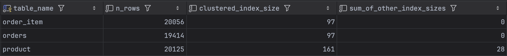
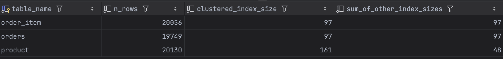

<!-- TOC -->

* [인덱스란?](#인덱스란)
    * [추가적인 쓰기 작업](#추가적인-쓰기-작업)
    * [언제 사용할까?](#언제-사용할까)
* [MySQL의 인덱스 자료구조](#mysql의-인덱스-자료구조)
    * [스토리지 엔진별 인덱스 자료구조](#스토리지-엔진별-인덱스-자료구조)
    * [B+트리](#b트리)
        * [B+트리란?](#b트리란)
        * [B+트리의 구조](#b트리의-구조)
        * [B+트리의 특징](#b트리의-특징)
        * [B+트리 장점](#b트리-장점)
        * [B+트리 단점](#b트리-단점)
    * [Hash](#hash)
        * [Hash란?](#hash란)
        * [Hash의 장점](#hash의-장점)
        * [Hash의 단점](#hash의-단점)
* [인덱스 설정](#인덱스-설정)
    * [인덱스 설정 시 고려 사항](#인덱스-설정-시-고려-사항)
        * [1. 인덱스의 특징](#1-인덱스의-특징)
            * [슬로우 쿼리 특정 방법](#슬로우-쿼리-특정-방법)
        * [2. 카디널리티(Cardinality)](#2-카디널리티cardinality)
        * [3. 선택도(Selectivity)](#3-선택도selectivity)
            * [인덱스 설계할 때의 선택도](#인덱스-설계할-때의-선택도)
            * [쿼리 최적화할 때의 선택도](#쿼리-최적화할-때의-선택도)
        * [4. 인덱스 설정 기본 수칙](#4-인덱스-설정-기본-수칙)
* [인덱스 적용 보고서](#인덱스-적용-보고서)
    * [개요](#개요)
    * [인덱스 적용 쿼리 선정](#인덱스-적용-쿼리-선정)
    * [인기상품 조회 API 인덱스 적용](#인기상품-조회-api-인덱스-적용)
        * [인덱스 추가 흐름](#인덱스-추가-흐름)

<!-- TOC -->

# 인덱스란?

인덱스는 **추가적인 저장 공간(DB의 10% 정도)과 쓰기 작업을 통해 테이블의 검색 속도를 높이는 자료구조**이다. 여기서 말하는 테이블의 검색 속도는 명시적인 검색(SELECT) 뿐만 아니라 UPDATE,
DELETE 에 사용되는 조건도 포함된다.

## 추가적인 쓰기 작업

인덱스는 정렬된 상태여야 원하는 데이터를 검색할 수 있다. 그래서 인덱스가 적용된 컬럼에 INSERT, UPDATE, DELETE가 수행되면 추가적인 연산 작업을 해야한다.

- INSERT: 새로운 데이터에 대한 인덱스 추가
- UPDATE: 기존 인덱스를 **사용안함** 처리 후 갱신된 데이터에 대한 인덱스를 추가
- DELETE: 삭제 데이터에 대한 인덱스를 **사용안함** 처리

UPDATE, DELETE 수행 시 인덱스를 삭제하는 것이 아니라 **사용안함** 처리를 한다.  
따라서, 인덱스가 실제 데이터보다 훨씬 많이 존재할 수 있어 성능이 저하될 수 있다.

## 언제 사용할까?

- 규모가 큰 테이블
- INSERT, UPDATE, DELETE가 자주 발생하지 않는 컬럼
- 조건(`WHERE`, `JOIN`)이나 정렬(`ORDER BY`), 그룹(`GROUP BY`)에 자주 사용되는 컬럼
- 데이터의 중복도가 낮은(=카디널리티가 높은) 컬럼

# MySQL의 인덱스 자료구조

MySQL 인덱스는 주로 **B-트리(B-Tree)** 또는 **해시(Hash)** 자료구조로 구현된다.   
엄밀하게는 B-트리가 아니라 B+트리(B+Tree)이다. 하지만 MySQL 공식 문서에는 B-Tree라고 표기되어 있는데,  
내부적으로는 B+트리로 동작하지만 일반적인 의미에서의 B-트리를 의미하는 것으로 생각된다.

좀 더 정확한 의미 전달을 위해 B-트리와 B+트리를 엄격하게 구분하여 기술한다.

## 스토리지 엔진별 인덱스 자료구조

- InnoDB: B+Tree
- MyISAM: B+Tree
- MEMORY(HEAP): Hash (B-Tree 선택 가능)

## B+트리

### B+트리란?

B+트리는 B-트리의 변형 중 하나이다. 따라서 B-트리에 대해 먼저 알아보자.

#### B-트리

B-트리는 DB와 파일 시스템에서 많이 사용되는 트리 자료구조의 한 종류이다.   
기본적으로 "이진 트리에서 하나의 노드가 가질 수 있는 최대 자식 노드 숫자가 2보다 큰 트리"이다.    
최대 자식 노드 숫자가 N인 B-트리를 **N차 B-트리**라고 한다.

#### B+트리

B-트리에서 데이터는 **내부 노드와 리프 노드에 저장**되는데 내부 노드에 데이터가 흩어져있어 순차적인 접근(범위 검색)이 어려워지고, 이는 더 많은 디스크 I/O, 성능 저하, 메모리 효율 감소의 원인이
된다.  
B+트리는 리프 노드에만 데이터를 저장하고, 내부 노드는 리프 노드로의 인덱스 역할을 해서 B-트리의 단점을 극복했다.  
즉, B+트리는 **리프노드에만 데이터가 저장되는 B-트리**라고 볼 수 있다.

### B+트리의 구조

그림 추가하기

- 루트(Root) 노드: 트리의 최상단 노드
- 리프(Leaf) 노드: 트리의 최하단 노드
- 내부(Internal) 노드: 루트 노드와 리프 노드 사이의 노드
- 키(key): 각 노드내에서 데이터를 구분하는 값
- 포인터(pointer): 각 노드가 자식 노드를 가리키는 링크

### B+트리의 특징

- 모든 데이터는 리프 노드에만 저장되고, 내부 노드에는 키(key) 값만 저장된다.
- 모든 리프 노드가 같은 레벨에 위치해 검색, 삽입, 삭제 연산의 시간복잡도는 $O(longN)$이다.
- 모든 리프 노드는 연결 리스트로 연결되어 있어 순차적인 데이터 접근(범위 검색)이 용이
- M차 B+트리를 만족하기 위한 조건은 아래와 같다.
    - 각 노드의 최대 자식 노드 수: M
    - 각 노드의 최대 키(key) 수: M - 1
    - 각 노드의 최소 자녀 노드 수: ⌈M/2⌉. 단, 루트, 리프 노드 제외
    - 각 노드의 최소 키(key) 수: ⌈M/2⌉ - 1. 단, 루트 노드 제외
    - 예를 들어, 5차 B+트리의 조건은 아래와 같다.
        - 각 노드의 최대 자식 노드 수: 5
        - 각 노드의 최대 키(key) 수: 4 (5 - 1)
        - 각 노드의 최소 자녀 노드 수: 3 (⌈5/2⌉)
        - 각 노드의 최소 키(key) 수: 2 (⌈5/2⌉) - 1

### B+트리 장점

- 빠른 검색 속도: 모두 같은 레벨에 위치한 리프 노드에만 데이터가 저장되므로 검색 속도가 빠름
- 효율적인 순차 접근(범위 검색): 리프 노드는 연결 리스트로 연결되어 있어 순차적인 데이터 접근이 용이
- 메모리 효율성: 내부 노드에는 키(key) 값만 저장하므로 메모리 사용량을 줄일 수 있음
- 안정적인 성능: 트리 자체적으로 균형을 잡기 때문에 편향 이진 트리와 같은 문제가 발생하지 않음

### B+트리 단점

- 추가적인 저장 공간: 리프 노드의 연결 리스트를 저장할 추가적인 저장 공간이 필요
- 삽입/삭제 연산 오버헤드: 삽입/삭제 연산 시 트리의 균형을 맞추기 위한 추가적인 작업이 필요

## Hash

### Hash란?

해시(Hash)는 키-값 쌍을 저장하는 자료구조로, 특정 키에 대한 값을 $O(1)$ 시간으로 찾을 수 있다.  
해시 함수를 이용해 키 값을 해시 값으로 변환하고, 이를 이용해 데이터에 접근한다.  
해시 자료구조의 특성상 범위 검색이나 정렬된 결과가 필요한 경우에는 적합하지 않다.

### Hash의 장점

- 빠른 검색 속도: 해시 자료구조 특성상 특정 값을 조회하는데 $O(1)$을 보장
- 간단한 구조: 해시 테이블 기반으로 구현되어 있어 구조가 간단함

### Hash의 단점

- 범위 검색 불가능: 해시 함수는 입력 값의 순서를 보장하지 않아 범위 검색을 할 수 없음
- 정렬된 결과 불가능: 해시 함수는 입력 값의 순서를 보장하지 않아 정렬된 결과 반환 불가능
- 해시 충돌 가능성: 해시 충돌이 발생하면 성능이 저하될 수 있음

# 인덱스 설정

## 인덱스 설정 시 고려 사항

### 1. 인덱스의 특징

- 인덱스는 조회 성능 향상을 위해 사용한다.
- 인덱스가 많을 수록 삽입,수정,삭제 성능은 저하된다.
- 따라서, 인덱스 설정시 정확하게 **어떤 쿼리**에서 **어떤 컬럼**이 인덱스로 추가되어야 할지 분석해야 한다.

#### 슬로우 쿼리 특정 방법

- MySQL 슬로우 쿼리 로그 활성화
    - `my.cnf` 파일에 아래의 설정 추가
    - `slow_query_log=1`
    - `slow_query_log_file=파일.log` (로그 파일의 절대 경로 작성)
    - `long_query_time=시간` (시간의 단위는 초)
- MySQL에서 제공하는 통계 확인
    - `sys.statement_analysis`: 실행된 모든 쿼리의 전반적인 실행 통계
    - `sys.statements_with_runtimes_in_95th_percentile`: 실행 시간이 상위 5%에 해당하는 쿼리 목록
    - `sys.statements_with_full_table_scans`: 풀 스캔이 발행한 쿼리 목록
    - `sys.statements_with_temp_tables`: 임시 테이블을 사용한 쿼리 목록
- APM 도구 활용

### 2. 카디널리티(Cardinality)

- 카디널리티란 특정 컬럼의 고유 값의 개수를 의미한다.
- 간단하게 생각하자면 `count(distinct column_name)`가 카디널리티이다.
- MySQL에서`show indexes` 명령의 결과 중 `cardinality` 컬럼을 통해 확인할 수 있다.
- 일반적으로 카디널리티가 높을 수록 B-Tree 인덱스 효율이 좋아지는 경향이 있다.
    - 인덱스 효율은 테이블 크기, 쿼리 패턴, 데이터 분포 등 다양한 요소에 영향을 받는다.
    - 따라서, 카디널리티가 높다고 무조건 인덱스 효율이 좋지는 않다.

### 3. 선택도(Selectivity)

- 선택도는  "인덱스 설계"할 때와 "쿼리 최적화"할 때에 서로 다른 의미를 가진다.

#### 인덱스 설계할 때의 선택도

- 인덱스 설계할 때의 선택도는 특정 컬럼의 값이 얼마나 고유한지를 비율로 표현한 것이다.
- $$선택도 = \frac{고유한\ 값의\ 개수(distinct)}{전체\ 레코드\ 수}$$
- $$= \frac{카디널리티}{전체\ 레코드\ 수}$$
- $$= \frac{count(discint\ column_name)}{count(*)}$$
- 선택도가 높다는 것은 대부분의 행을 필터링할 수 있어 인덱스 효율이 좋다.
- 선택도가 낮다는 것은 중복 값이 많아 풀 스캔보다 느려질 가능성이 있다.
- 단, 선택도가 낮아도 복합 인덱스의 일부로 사용되면 좋은 성능을 기대할 수 있다. (커버링 인덱스)

#### 쿼리 최적화할 때의 선택도

- 쿼리 최적화할 때의 선택도는 특정 조건에 부합하는 값의 비율이다.
- $$선택도 = \frac{count(case\ when\ columnA\ =\ :condition\ then\ 1\ end)}{count(*)}$$
- 선택도가 높다는 것은 조건을 만족하는 행이 많다는 것으로 인덱스 사용이 비효율적이다.
- 선택도가 낮다는 것은 조건을 만족하는 행이 적다는 것으로 인덱스 사용이 효율적이다.
- 단, 선택도가 낮다고 모든 상황에 좋은 것은 아니고 쿼리 패턴, 데이터 분포 등 다양한 요소에 영향을 받는다.

### 4. 인덱스 설정 기본 수칙

- 조건, 그룹, 정렬에 자주 사용되는 컬럼을 인덱스로 설정
- 범위 검색에 사용되는 컬럼은 뒤쪽에 설정
- 그룹, 정렬에 사용되는 인덱스는 실제 그룹 또는 정렬 순서와 동일하게 구성
- 카디널리티가 높은 컬럼을 앞쪽에 배치
- 선택도가 낮은 컬럼을 앞쪽에 배치
- NULL 값이 많은 컬럼은 인덱스 효과가 없을 수 있음
- 데이터 변경이 잦은 컬럼은 인덱스 사용 자제
- LIKE 검색을 할 때는 뒤쪽에 와일드 카드 사용
    - 여의치 않은 경우 전문 검색 인덱스(Full Text Index) 고려

# 인덱스 적용 보고서

## 개요

인덱스 적용 전, 후를 비교하기 위해서는 인덱스를 활용할 수 있는 데이터셋이 필요하다.
예를 들어 프로젝트에서는 데이터 삭제시 soft-delete 방식을 사용해 데이터를 삭제하기 때문에 일반적으로는 deleted_at 컬럼에 인덱스를 추가하는 것이 좋다.  
하지만 deleted_at 컬럼이 비어 있는 데이터가 많을 경우 인덱스를 활용할 수 없다.  
그래서 쿼리에 사용될 수 있는 모든 인덱스를 추출하는 것보다 핵심 인덱스를 적용해 인덱스 적용 전, 후를 비교하며 인덱스의 중요성을 확인하는 것에 초점을 맞춘다.

## 인덱스 적용 쿼리 선정

모든 쿼리를 실행해보고 `sys.statements_with_runtimes_in_95th_percentile`에 조회되는 쿼리 목록 중 가장 성능이 떨어지는 쿼리를 특정했다.  
"인기상품 조회 API" 쿼리가 압도적으로 성능이 떨어지는 것을 확인했고, 해당 쿼리에 인덱스를 적용하기로 결정했다.

## 인기상품 조회 API 인덱스 적용

"인기상품 조회 API"는 최근 3일간 가장 많이 팔린 상품 5개를 조회하는 API이다.  
실제 호출되는 SQL 쿼리는 아래와 같다.

```mysql
select p.id, p.name, sum(oi.quantity)
from product p
         join order_item oi on p.id = oi.product_id and oi.deleted_at is null
         join orders o on oi.order_id = o.id and o.deleted_at is null
where p.deleted_at is null
  and o.updated_at between timestamp(date_sub(current_date, interval 3 day)) and timestamp(current_date)
group by p.id
order by sum(oi.quantity) desc
limit 5;
```

인덱스를 걸기 위해 고려한 사항은 아래와 같다.

1. 모든 테이블에 `deleted_at is null` 필터링이 적용되므로 기본적으로 deleted_at 컬럼을 인덱스에 추가한다.
2. `deleted_at is null`에 해당하는 데이터가 훨씬 많을 것이다.
3. 세 개의 테이블 중 order_item의 데이터 수가 제일 많다.
4. 조건에 사용되는 컬럼은 아래와 같다.
    - order_item.product_id
    - order_item.order_id
    - orders.updated_at (범위)
5. 그룹에 사용되는 컬럼은 아래와 같다.
    - product.id (PK)
6. 정렬에 사용되는 컬럼은 아래와 같다.
    - order_item.quantity (집계 합수 사용)

### 인덱스 추가 흐름

쿼리의 실행 계획을 분석하고 알맞은 인덱스를 추가해본다.

#### 0. No Index


- order_item을 풀 스캔한 결과를 `deleted_at is null` 조건으로 필터링 후 product와 NL Join 수행
- 풀 스캔한 데이터가 20,000건으로 많고 이를 NL Join 하기 때문에 가장 먼저 해결해야할 포인트
- product와의 조인 대상 컬럼인 order_item.product_id, order_item.deleted_at을 인덱스로 추가

#### 2. order_item(product_id, deleted_at)


- order_item 스캔방식이 `Unique Index Scan (Index lookup)`으로 변경되었고, deleted_at 필터링 과정이 삭제됨
- `Index lookup`은 **조회 데이터가 테이블의 20~25% 이상**이거나 **lookup 후 실제 테이블 접근이 많이 발생할 때** 비효율적
    - 현재 실행 계획만으로는 이를 개선할 방법이 떠오르지 않으므로 다른 테이블을 개선
- orders와의 조인 대상 컬럼인 order_item.order_id을 인덱스로 추가
- (product_id, deleted_at) 인덱스가 존재하므로 두 가지 방식이 가능하다.
    - (product_id, deleted_at), (order_id) 별개의 인덱스로 구성
    - (order_id, product_id, deleted_at)으로 복합 인덱스 구성
        - 복합 인덱스로 구성한다면 product_id와 order_id의 순서는 **선택도**에 의해 결정
        - 선택도 = 카디널리티 / 전체 데이터 수
            - 3일간의 데이터 수가 order_item은 20,000건, orders는 1,000건, product는 100건인 경우
            - order_id의 선택도 = 1000 / 20000 = 0.05
            - product_id의 선택도 = 100 / 20000 = 0.005
            - order_id의 선택도가 더 높으므로 order_id, product_id 순으로 인덱스 설정
- order_item과 product만 조인되는 경우는 많지 않으므로 `order_item(order_id, product_id, deleted_at)` 복합 인덱스로 구성

#### 3. order_item(order_id, product_id, deleted_at)


- orders를 풀 스캔한 결과를 `updated 범위 and deleted_at is null` 조건으로 필터링 후 order_item과 NL Join 수행
- orders와 order_item 사이에 추가할만한 유의미한 인덱스는 없음
- orders의 효율적인 필터링을 위해 `orders(updated_at, deleted_at)` 인덱스 추가

#### 4. order_item(order_id, product_id, deleted_at) + orders(updated_at, deleted_at)


- quantity는 집계 연산(sum)과 정렬에 사용된다.
- `order_item(order_id, product_id, deleted_at)`에 quantity를 추가하면 인덱스 스캔만으로 쿼리를 완료할 수 있음
- 즉, 인덱스에서 다시 테이블을 조회하는 과정이 생략되므로 성능상 이점이 있음
- quantity와 deleted_at의 순서는 데이터와 시스템 특성에 따라 다르게 적용할 수 있다.
    - `order_item(order_id, product_id, quantity, deleted_at)`
        - 장점
            - `deleted_at is null`인 데이터가 많을 경우 효율적
            - quantity 값을 자주 조회하는 경우 효율적
        - 단점
            - 집계 연산을 인덱스 스캔만으로 처리할 수 없음
    - `order_item(order_id, product_id, deleted_at, quantity)`
        - 장점
            - 집계 연산을 인덱스 스캔만으로 처리할 수 있음
        - 단점
            - `deleted_at is null`인 데이터가 많을 경우 비효율적
            - quantity 값을 자주 조회하는 경우 비효율적
- 일반적으로는 삭제된 컬럼보다 삭제되지 않은 컬럼이 더 많다. 즉, `deleted_at is null`에 해당하는 데이터가 많다.
- 또한, quantity는 자주 조회되는 값이므로 `order_item(order_id, product_id, quantity, deleted_at)` 복합 인덱스로 구성

#### 5. order_item(order_id, product_id, quantity, deleted_at) + orders(updated_at, deleted_at)


## 인덱스 사용 전 후의 테이블 상태





인덱스 추가 전(위), 후(아래)를 비교해보면 `sum_of_other_index_sizes`의 값이 증가된 것을 볼 수 있다.  
`sum_of_other_index_sizes`는 PK 인덱스를 제외한 나머지 인덱스들이 차지하는 페이지 수 총합이다.  
1 페이지는 16KB이므로, 인덱스 추가로 인해 약 1.5MB의 공간을 추가로 차지하는 것을 확인할 수 있다.  

