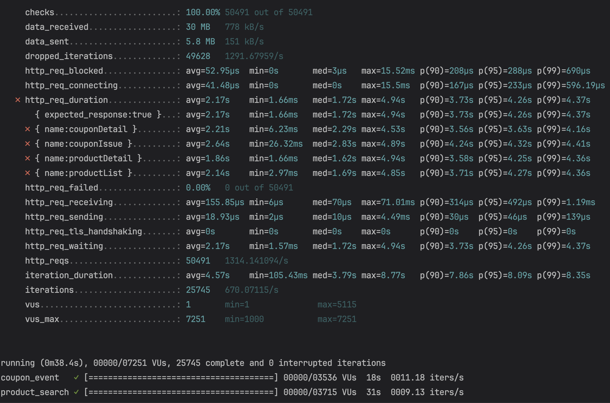
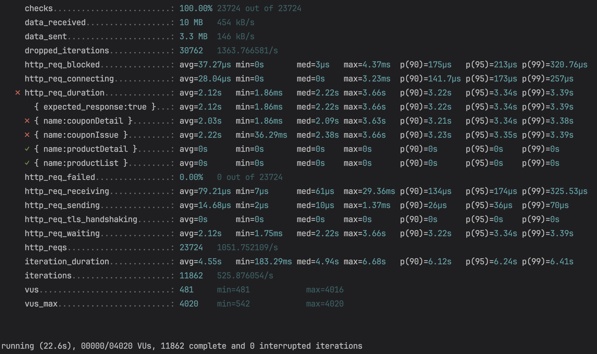
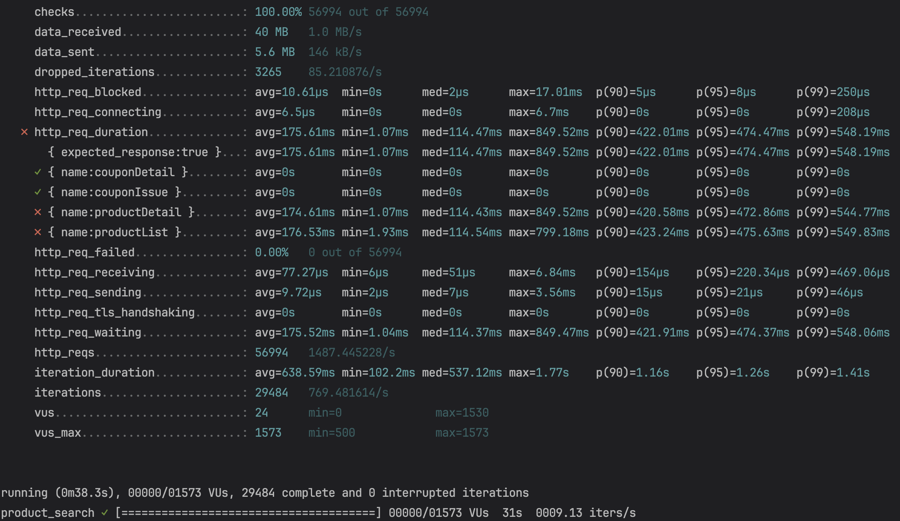

# 부하 테스트

## 부하 테스트 보고서

### 부하 테스트 시나리오

부하 테스트는 단일 API를 대상으로 진행할 수도 있고, 여러 API를 하나의 단위로 진행할 수도 있다.
진행할 부하 테스트 시나리오는 '선착순 쿠폰 이벤트 진행시 쿠폰 발급과 상품 조회'이다. 자세한 내용은 다음과 같다. 

1. 쿠폰 단건 조회 API 호출: 발급 가능 수량이 1,000개인 쿠폰을 대상으로 초당 최대 4,000건의 조회를 요청한다.
2. 쿠폰 발급 API 호출: 조회한 쿠폰에 대해 발급 요청을 한다.
3. 상품 목록 조회 API: 상품명으로 상품 목록을 조회할 수 있으므로 전체 조회와 상품 검색을 랜덤하게 요청한다.
4. 상품 단건 조회 API: 조회한 상품 목록 중 하나의 상품에 대해 상세 조회 요청을 한다.

#### 적절한 테스트 유형

시나리오는 크게 "쿠폰"과 "상품"으로 나눌 수 있다.  

###### 1. 쿠폰

단발성 쿠폰 이벤트이므로 짧은 시간에 사용자가 많이 몰리는 버스트 트래픽이 발생할 것이므로 스파이크 테스트는 필수적으로 포함되어야 한다.  
또한, 쿠폰의 수량이 많지 않으므로 짧은 시간 동안 높은 트래픽을 유지하고, 트래픽이 빠르게 빠진다.  
따라서 "스파이크 테스트"와 "부하 테스트" 유형이 적합하다고 생각한다.

###### 2. 상품

쿠폰 이벤트에 참여한 직후 상품을 조회하는 시나리오를 생각했기 때문에 점진적으로 트래픽이 증가할 것이고,  
긴 시간동안 트래픽이 유지되고, 서서히 줄어들 것이다.  
따라서 "러핑 테스트"와 "부하테스트" 유형이 적합하다고 생각한다. 

### 부하 테스트 결과

- p(99) 뿐아니라 avg 수치도 매우 느림. 

#### 분석

우선, 병목지점을 파악하는 것이 중요하다. "쿠폰"과 "상품"으로 나누어 어떤 그룹의 어떤 API가 병목지점인지 확인해보자. 

###### 쿠폰 그룹만 실행

"쿠폰"만 테스트 했을 때, p(99) 기준 약 1초정도 빨라진 것을 확인할 수 있었다.  

###### 상품 그룹만 실행

  

목표치에 도달하지는 못했지만 p(99) 기준 약 4초정도 빨라진 것을 확인할 수 있었다.

#### 결론

현재 쿠폰 발급시 비관적 락을 이용해 동시성 제어를 하고 있어, 전체적인 성능 저하를 유발하고 있다.  
따라서, 높은 가용성과 동시성을 손쉽게 제어해주는 **분산 락, 메시지 큐와 같은 방법을 고려**해볼 수 있을 것이다.  
