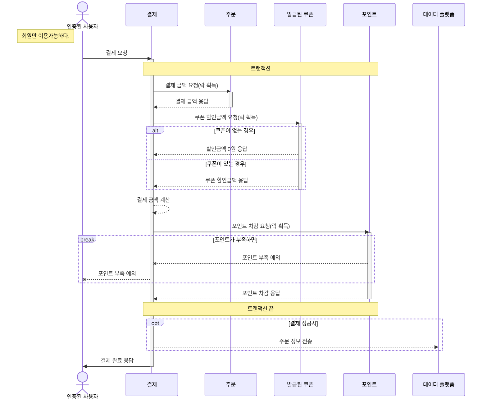

```mermaid
sequenceDiagram
    %% 상품 구매
    actor user as 인증된 사용자
    participant payment as 결제
    participant order as 주문
    participant coupon as 발급된 쿠폰
    participant point as 포인트
    participant platform as 데이터 플랫폼

    note left of user: 회원만 이용가능하다.
    
    user->>payment: 결제 요청
    activate payment

    note over payment,point: 트랜잭션
    
    payment->>order: 결제 금액 요청(락 획득)
    activate order
    order-->>payment: 결제 금액 응답
    deactivate order
    
    payment->>coupon: 쿠폰 할인금액 요청(락 획득)
    activate coupon
    alt 쿠폰이 없는 경우
        coupon-->>payment: 할인금액 0원 응답
    else 쿠폰이 있는 경우
        coupon-->>payment: 쿠폰 할인금액 응답
    end 
    deactivate coupon
    
    payment-->>payment: 결제 금액 계산
    
    payment->>point: 포인트 차감 요청(락 획득)
    activate point
    break 포인트가 부족하면
        point--xpayment: 포인트 부족 예외
        payment--xuser: 포인트 부족 예외
    end
    point-->>payment: 포인트 차감 응답
    deactivate point
    
    note over payment,point: 트랜잭션 끝
    
    opt 결제 성공시
        payment-->>platform: 주문 정보 전송
    end

    payment->>user: 결제 완료 응답
    deactivate payment
```
