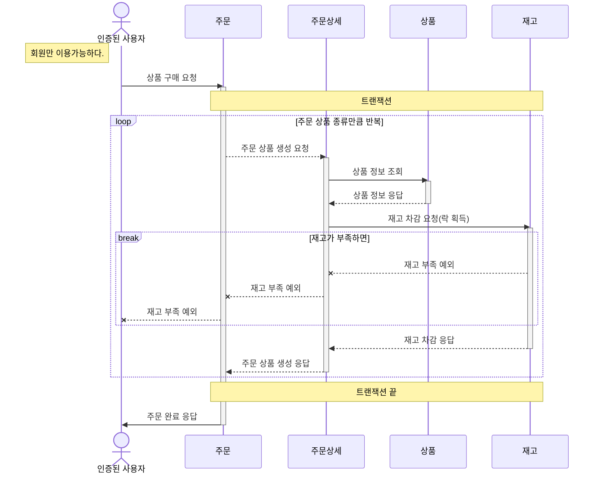

```mermaid
sequenceDiagram
%% 상품 구매
    actor user as 인증된 사용자
    participant order as 주문
    participant orderItem as 주문상세
    participant product as 상품
    participant stock as 재고
    
    note left of user: 회원만 이용가능하다.
    
    user ->> order: 상품 구매 요청
    activate order
    
    note over order, stock: 트랜잭션

    loop 주문 상품 종류만큼 반복
        order -->> orderItem: 주문 상품 생성 요청
        activate orderItem
        
        orderItem ->> product: 상품 정보 조회
        activate product
        product -->> orderItem: 상품 정보 응답
        deactivate product
        
        orderItem ->> stock: 재고 차감 요청(락 획득)
        activate stock
        break 재고가 부족하면
            stock --x orderItem: 재고 부족 예외
            orderItem --x order: 재고 부족 예외
            order --x user: 재고 부족 예외
        end
        stock -->> orderItem: 재고 차감 응답
        deactivate stock

        orderItem -->> order: 주문 상품 생성 응답
        deactivate orderItem
    end

    note over order, stock: 트랜잭션 끝
    
    order ->> user: 주문 완료 응답
    deactivate order
```
