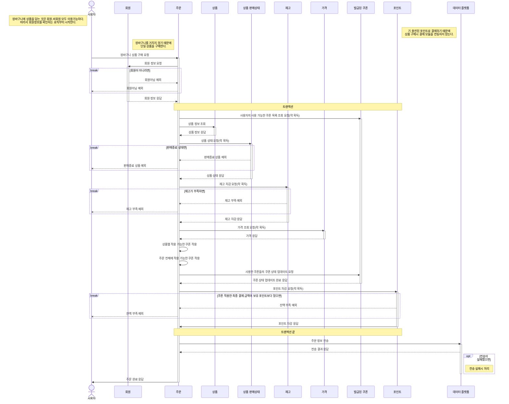

```mermaid
sequenceDiagram
    %% 장바구니에 담긴 상품들 구매
    actor user as 사용자
    participant member as 회원
    participant order as 주문
    participant product as 상품
    participant status as 상품 판매상태
    participant stock as 재고
    participant price as 가격
    participant couponIssue as 발급된 쿠폰
    participant point as 포인트
    participant platform as 데이터 플랫폼
    
    note left of user: 장바구니에 상품을 담는 것은 회원,비회원 모두 이용가능하다.<br/>따라서 회원정보를 확인하는 로직부터 시작한다.
    note right of point: 기 충전된 포인트로 결제하기 때문에<br/>상품 구매시 결제 모듈을 연동하지 않는다.
    note left of order: 장바구니를 거치지 않기 때문에<br/>단일 상품을 구매한다.
    
    user->>order: 장바구니 상품 구매 요청
    activate order

    order->>member: 회원 정보 요청
    activate member
    break 회원이 아니라면
        member--xorder: 회원아님 예외
        order--xuser: 회원아님 예외
    end
    member-->>order: 회원 정보 응답
    deactivate member

    note over order,point: 트랜잭션
    
    order->>couponIssue: 사용자의 사용 가능한 쿠폰 목록 조회 요청(락 획득)
    activate couponIssue
    
    order->>product: 상품 정보 조회
    activate product
    product-->>order: 상품 정보 응답
    deactivate product
    
    order->>status: 상품 상태 요청(락 획득)
    activate status
    break 판매종료 상태면
        status--xorder: 판매종료 상품 예외
        order--xuser: 판해종료 상품 예외
    end
    status-->>order: 상품 상태 응답
    deactivate status
    
    order->>stock: 재고 차감 요청(락 획득)
    activate stock
    break 재고가 부족하면
        stock--xorder: 재고 부족 예외
        order--xuser: 재고 부족 예외
    end
    stock-->>order: 재고 차감 응답
    deactivate stock
    
    order->>price: 가격 조회 요청(락 획득)
    activate price
    price-->>order: 가격 응답
    deactivate price
    
    order->>order: 상품별 적용 가능한 쿠폰 적용
    
    order->>order: 주문 전체에 적용 가능한 쿠폰 적용
    
    order->>couponIssue: 사용한 쿠폰들의 쿠폰 상태 업데이트 요청
    couponIssue-->>order: 쿠폰 상태 업데이트 완료 응답
    deactivate couponIssue
    
    order->>point: 포인트 차감 요청(락 획득)
    activate point
    break 쿠폰 적용한 최종 결제 금액이 보유 포인트보다 많으면
        point--xorder: 잔액 부족 예외
        order--xuser: 잔액 부족 예외
    end
    point->>order: 포인트 차감 응답
    deactivate point

    note over order,point: 트랜잭션 끝
    
    order->>platform: 주문 정보 전송
    activate platform
    platform-->>order: 전송 결과 응답
    opt 전송이 실패했으면
        note right of platform: 전송 실패시 처리
    end
    deactivate platform
    
    order->>user: 주문 완료 응답
    deactivate order
```
