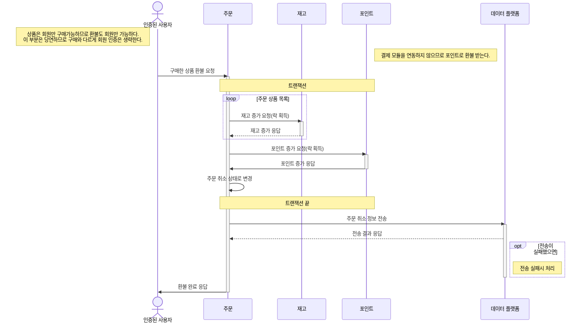

```mermaid
sequenceDiagram
    %% 장바구니에 담긴 상품들 구매
    actor user as 인증된 사용자
    participant order as 주문
    participant stock as 재고
    participant point as 포인트
    participant platform as 데이터 플랫폼
    
    note left of user: 상품은 회원만 구매가능하므로 환불도 회원만 가능하다.<br/>이 부분은 당연하므로 구매와 다르게 회원 인증은 생략한다.
    note right of point: 결제 모듈을 연동하지 않으므로 포인트로 환불 받는다.
    
    user->>order: 구매한 상품 환불 요청
    activate order

    note over order,point: 트랜잭션
    
    loop 주문 상품 목록
        order->>stock: 재고 증가 요청(락 획득)
        activate stock
        stock-->>order: 재고 증가 응답
        deactivate stock
    end 
    
    order->>point: 포인트 증가 요청(락 획득)
    activate point
    point->>order: 포인트 증가 응답
    deactivate point
    
    order->>order: 주문 취소 상태로 변경
    
    note over order,point: 트랜잭션 끝
    
    order->>platform: 주문 취소 정보 전송
    activate platform
    platform-->>order: 전송 결과 응답
    opt 전송이 실패했으면
        note right of platform: 전송 실패시 처리
    end
    deactivate platform
    
    order->>user: 환불 완료 응답
    deactivate order
```
