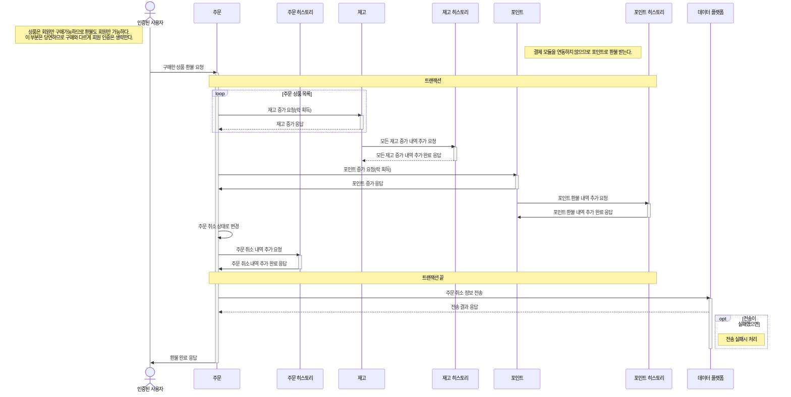

```mermaid
sequenceDiagram
    %% 장바구니에 담긴 상품들 구매
    actor user as 인증된 사용자
    participant order as 주문
    participant orderHistory as 주문 히스토리
    participant stock as 재고
    participant stockHistory as 재고 히스토리
    participant point as 포인트
    participant pointHistory as 포인트 히스토리
    participant platform as 데이터 플랫폼
    
    note left of user: 상품은 회원만 구매가능하므로 환불도 회원만 가능하다.<br/>이 부분은 당연하므로 구매와 다르게 회원 인증은 생략한다.
    note right of point: 결제 모듈을 연동하지 않으므로 포인트로 환불 받는다.
    
    user->>order: 구매한 상품 환불 요청
    activate order

    note over order,pointHistory: 트랜잭션
    
    loop 주문 상품 목록
        order->>stock: 재고 증가 요청(락 획득)
        activate stock
        stock-->>order: 재고 증가 응답
        deactivate stock
    end 
    
    stock->>stockHistory: 모든 재고 증가 내역 추가 요청
    activate stockHistory
    stockHistory-->>stock: 모든 재고 증가 내역 추가 완료 응답
    deactivate stockHistory
    
    order->>point: 포인트 증가 요청(락 획득)
    activate point
    point->>order: 포인트 증가 응답
    deactivate point

    point->>pointHistory: 포인트 환불 내역 추가 요청
    activate pointHistory
    pointHistory->>point: 포인트 환불 내역 추가 완료 응답
    deactivate pointHistory
    
    order->>order: 주문 취소 상태로 변경
    
    order->>orderHistory: 주문 취소 내역 추가 요청
    activate orderHistory
    orderHistory->>order: 주문 취소 내역 추가 완료 응답
    deactivate orderHistory
    
    note over order,pointHistory: 트랜잭션 끝
    
    order->>platform: 주문 취소 정보 전송
    activate platform
    platform-->>order: 전송 결과 응답
    opt 전송이 실패했으면
        note right of platform: 전송 실패시 처리
    end
    deactivate platform
    
    order->>user: 환불 완료 응답
    deactivate order
```
