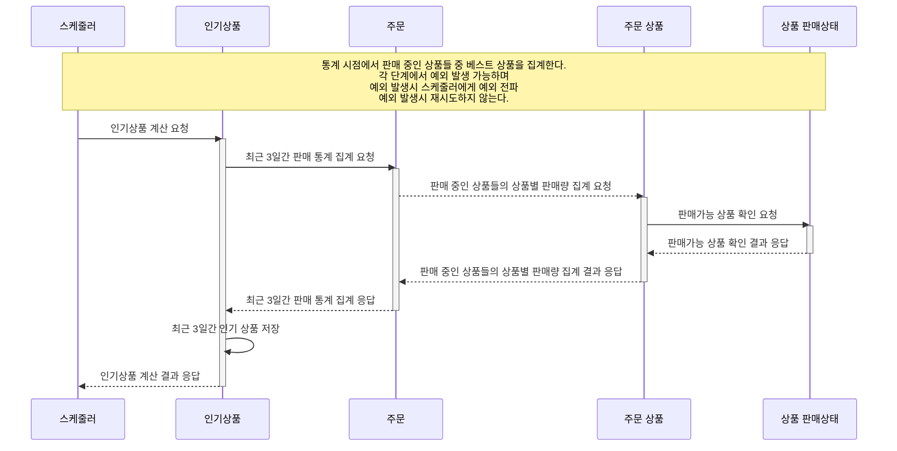

```mermaid
sequenceDiagram
    %% 인기 상품 집계
    participant scheduler as 스케줄러
    participant bestProduct as 인기상품
    participant order as 주문
    participant orderItem as 주문 상품
    participant status as 상품 판매상태

    note over scheduler,status: 통계 시점에서 판매 중인 상품들 중 베스트 상품을 집계한다.<br/>각 단계에서 예외 발생 가능하며<br/>예외 발생시 스케줄러에게 예외 전파<br/>예외 발생시 재시도하지 않는다.
    
    scheduler->>bestProduct: 인기상품 계산 요청
    activate bestProduct
    
    
    bestProduct->>order: 최근 3일간 판매 통계 집계 요청
    activate order
    
    order-->>orderItem: 판매 중인 상품들의 상품별 판매량 집계 요청
    activate orderItem
    
    orderItem->>status: 판매가능 상품 확인 요청
    activate status
    status-->>orderItem: 판매가능 상품 확인 결과 응답
    deactivate status
    
    orderItem-->>order: 판매 중인 상품들의 상품별 판매량 집계 결과 응답
    deactivate orderItem
    
    order-->>bestProduct: 최근 3일간 판매 통계 집계 응답
    deactivate order
    
    bestProduct->>bestProduct: 최근 3일간 인기 상품 저장
    bestProduct-->>scheduler: 인기상품 계산 결과 응답
    deactivate bestProduct
```
