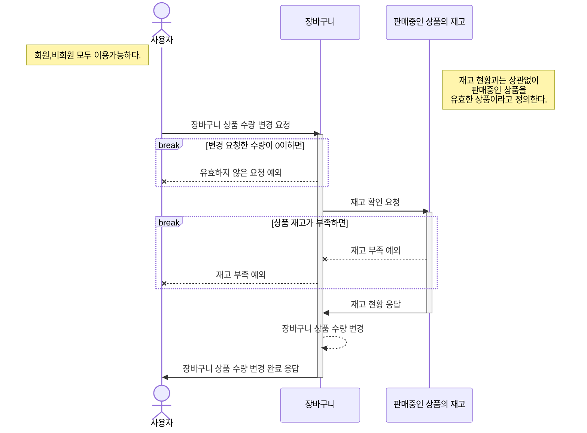

```mermaid
sequenceDiagram
    %% 장바구니 상품 수량 변경
    actor user as 사용자
    participant cartItem as 장바구니
    participant stock as 판매중인 상품의 재고
    
    note left of user: 회원,비회원 모두 이용가능하다.
    note right of stock: 재고 현황과는 상관없이<br/>판매중인 상품을<br/> 유효한 상품이라고 정의한다.
    
    user->>cartItem: 장바구니 상품 수량 변경 요청
    activate cartItem
    break 변경 요청한 수량이 0이하면
        cartItem--xuser: 유효하지 않은 요청 예외
    end
    
    cartItem->>stock: 재고 확인 요청
    activate stock
    break 상품 재고가 부족하면
        stock--xcartItem: 재고 부족 예외
        cartItem--xuser: 재고 부족 예외
    end
    stock->>cartItem: 재고 현황 응답
    deactivate stock
    
    cartItem-->>cartItem: 장바구니 상품 수량 변경
    
    cartItem->>user: 장바구니 상품 수량 변경 완료 응답
    deactivate cartItem
```
