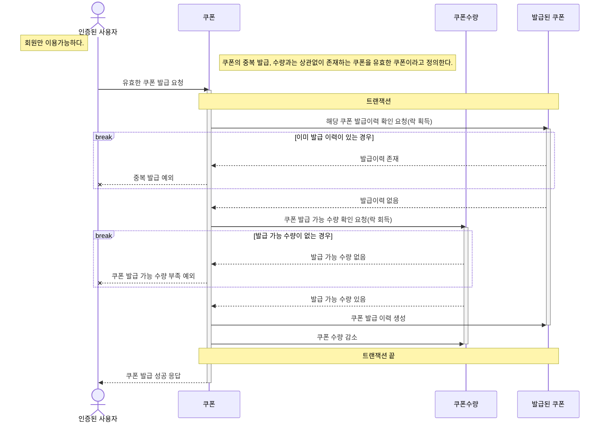

```mermaid
sequenceDiagram
    %% 인증된 사용자의 유효한 쿠폰 발급
    actor user as 인증된 사용자
    participant coupon as 쿠폰
    participant couponQuantity as 쿠폰수량
    participant couponIssue as 발급된 쿠폰
    
    note left of user: 회원만 이용가능하다.
    note right of coupon: 쿠폰의 중복 발급, 수량과는 상관없이 존재하는 쿠폰을 유효한 쿠폰이라고 정의한다. 
    
    user->>coupon: 유효한 쿠폰 발급 요청
    activate coupon
    
    note over coupon,couponIssue: 트랜잭션
    
    coupon->>couponIssue: 해당 쿠폰 발급이력 확인 요청(락 획득)
    activate couponIssue
    break 이미 발급 이력이 있는 경우
        couponIssue-->>coupon: 발급이력 존재
        coupon--xuser: 중복 발급 예외
    end
    couponIssue-->>coupon: 발급이력 없음

    coupon->>couponQuantity: 쿠폰 발급 가능 수량 확인 요청(락 회득)
    activate couponQuantity
    break 발급 가능 수량이 없는 경우
        couponQuantity-->>coupon: 발급 가능 수량 없음
        coupon--xuser: 쿠폰 발급 가능 수량 부족 예외
    end
    couponQuantity-->>coupon: 발급 가능 수량 있음

    coupon->>couponIssue: 쿠폰 발급 이력 생성
    deactivate couponIssue
    
    coupon->>couponQuantity: 쿠폰 수량 감소
    deactivate couponQuantity
    
    note over coupon,couponIssue: 트랜잭션 끝
    
    coupon-->>user: 쿠폰 발급 성공 응답
    deactivate coupon
```
