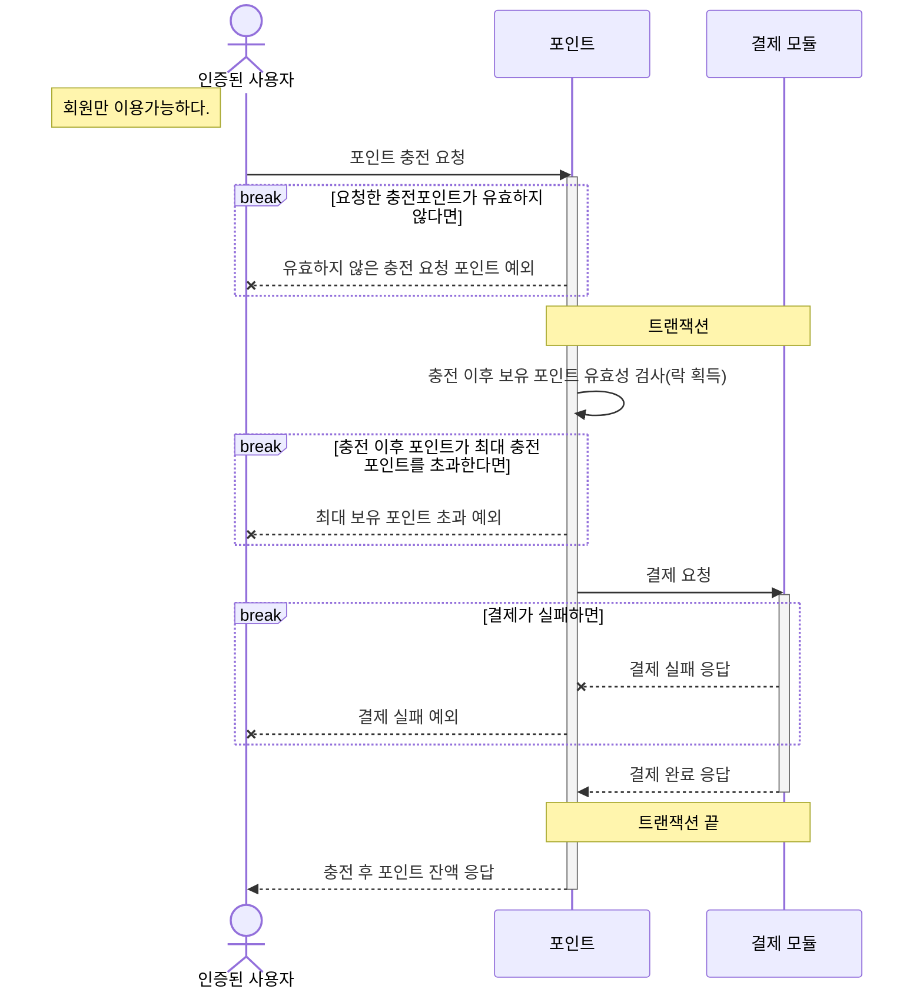

```mermaid
sequenceDiagram 
    %% 인증된 사용자의 포인트 충전
    actor user as 인증된 사용자
    participant point as 포인트
    participant module as 결제 모듈
    
    note left of user: 회원만 이용가능하다.

    user->>point: 포인트 충전 요청
    activate point
    break 요청한 충전포인트가 유효하지 않다면
        point--xuser: 유효하지 않은 충전 요청 포인트 예외
    end
    
    note over point,module: 트랜잭션 
    
    point->>point: 충전 이후 보유 포인트 유효성 검사(락 획득)
    break 충전 이후 포인트가 최대 충전 포인트를 초과한다면 
        point--xuser: 최대 보유 포인트 초과 예외
    end
    
    point->>module: 결제 요청
    activate module
    break 결제가 실패하면
        module--xpoint: 결제 실패 응답
        point--xuser: 결제 실패 예외
    end
    module-->>point: 결제 완료 응답
    deactivate module
    
    note over point,module: 트랜잭션 끝
    
    point-->>user: 충전 후 포인트 잔액 응답
    deactivate point
```
