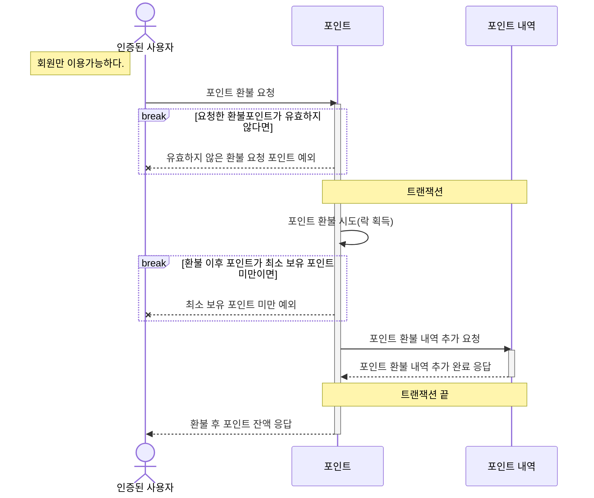

```mermaid
sequenceDiagram 
    %% 인증된 사용자의 포인트 충전
    actor user as 인증된 사용자
    participant point as 포인트
    participant pointHistory as 포인트 내역
    
    note left of user: 회원만 이용가능하다.

    user->>point: 포인트 환불 요청
    activate point
    break 요청한 환불포인트가 유효하지 않다면
        point--xuser: 유효하지 않은 환불 요청 포인트 예외
    end

    note over point,pointHistory: 트랜잭션
    
    point->>point: 포인트 환불 시도(락 획득)
    break 환불 이후 포인트가 최소 보유 포인트 미만이면 
        point--xuser: 최소 보유 포인트 미만 예외
    end

    point->>pointHistory: 포인트 환불 내역 추가 요청
    activate pointHistory
    pointHistory-->>point: 포인트 환불 내역 추가 완료 응답
    deactivate pointHistory
    
    note over point,pointHistory: 트랜잭션 끝
    
    point-->>user: 환불 후 포인트 잔액 응답
    deactivate point
```
